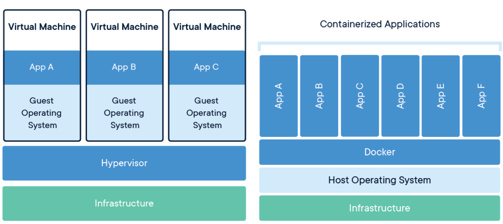
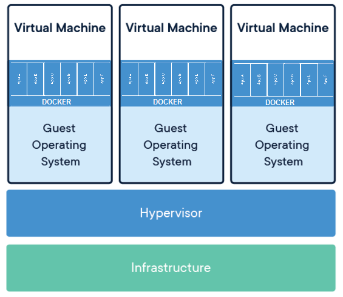
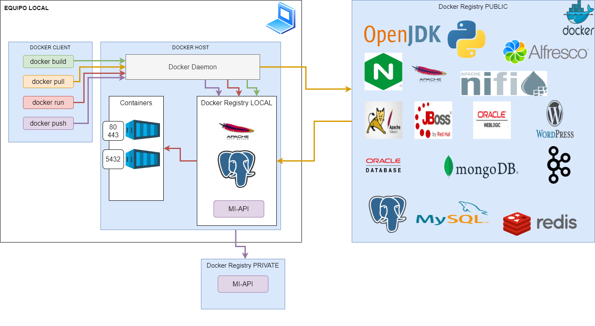
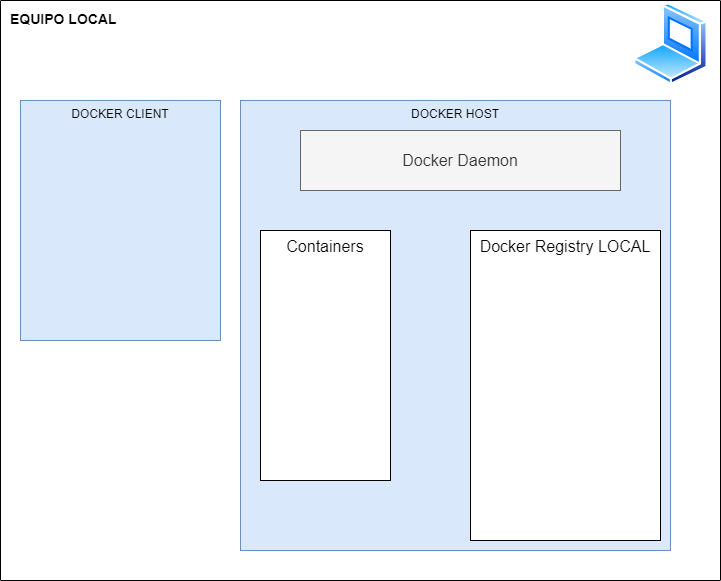
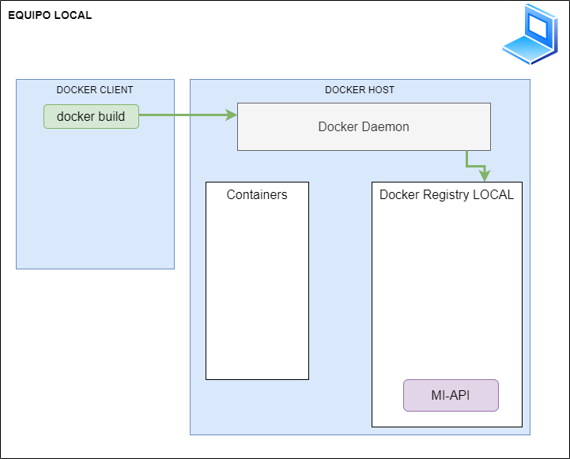
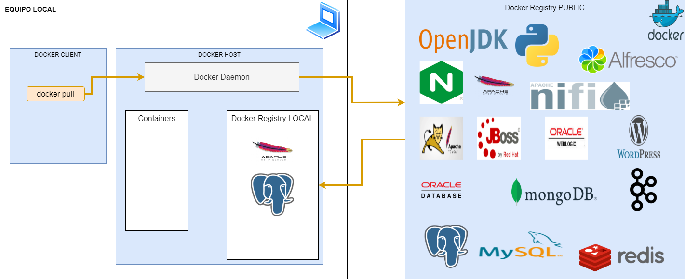
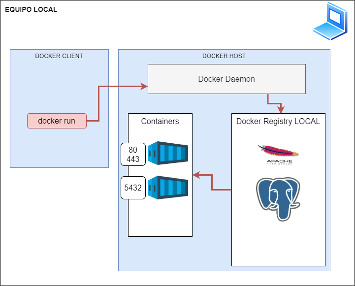
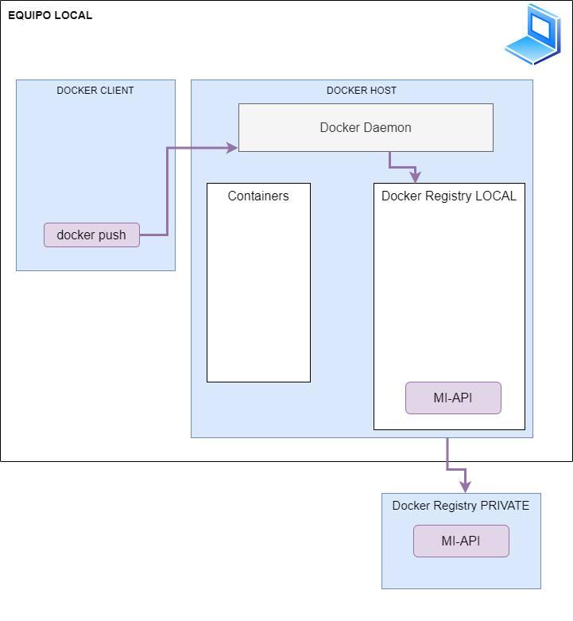

# Docker: Teoría


## Índice


---

- [Introducción](#introducción)
  - [¿Que es un contenedor?](#¿que-es-un-contenedor?)
  - [¿Por que Contenedores?](#¿por-que-contenedores?)
  - [Diferencias entre Máquina Virtual y Contenedor](#diferencias-entre-máquina-virtual-y-contenedor)
- [Docker Arquitectura](#docker-arquitectura)
  - [Componentes#](#componentes)
  - [Objetos](#objetos)
  - [Docker build](#docker-build)
  - [Docker pull](#docker-pull)
  - [Docker run](#docker-run)
  - [Docker push](#docker-push)
  - [Opciones de despliegue](#opciones-de-despliegue)
  - [Dockerfile](#dockerfile)
  - [Docker-compose](#docker-compose)
- [Casos de uso](#casos-de-uso)
- [Referencias](#referencias)


---


## Introducción

El siguiente documento va ser una caso de uso practico de contenedores.

- Se va centrar en el **uso local de contenedores** y **NO** va abordar posibles usos avanzados de los mismos como coreografía, Alta disponibilidad,...que podrían realizarse con [Docker Swarm](#docker) o Kubernetes.
- El **Sistema Operativo** base va ser **Windows**.
- La aplicación desarrollada en **Java 1.11 y SpringBoot**.


### ¿Que es un contenedor?


- Se trata de un proyecto Open Source para el empaquetado, transporte y ejecución de aplicaciones como un contenedor “ligero”.

- Es un nuevo modelo de virtualización que crea una capa de abstracción con el Sistema Operativo.

- Un contenedor, a su vez, contiene el contexto de ejecución de una aplicación aportando, de forma aislada, los siguientes componentes:
  - Memoria.
  - Procesos.
  - Sistema de Ficheros


> **NOTAS:** 
>
> Los contenedores se popularizaron en 2013 con la creación de la compañía [Docker](#docker), que no hizo sino reducir y simplificar la complejidad de gestionar los recursos de los sistemas (Memoria, CPU, Red, Almacenamiento) que ya existían mediante el uso de [CGroups](#referencias) y [namespaces](#referencias) desde 2006 mas o menos.
>
> Una de las principales motivaciones de la creación era poder "empaquetar" todo lo necesario (recursos, librerías, productos de terceros,...) para la ejecución de una aplicación. Es decir **poder empaquetar y distribuir la aplicación que en "mi equipo funciona" a otro**.
>
> Como nuevo entorno de ejecución empresarial de contenedores Google lanzo y dono a la comunidad [Kubernetes](#referencias) (también conocido como k8s) en 2014.


### ¿Por que Contenedores?


- Estandarización y Productividad.
- Eficiencia en Integración Continua.
- Compatibilidad y facilidad de Mantenimiento.
- Simplicidad y Configuraciones más rápidas.
- Acelera los despliegues.
- Mejora en Despliegue Continuo y Testing.
- Despliegue en Plataformas “Multi-Cloud”.
- Aislamiento.
- Seguridad.


> NOTAS:
>
> Actualmente se pueden ejecutar contenedores en todas las plataformas: Linux, Windows, Power, z/OS.
>
> - **Estandard**: Docker crea los estandares de la industria por eso son “portables” a cualquier plataforma.
>
> - **"Ligeros”:** Los contenedores comparten el SO del anfitrion por lo que no requiere un SO por aplicación.
>
> - **Seguros:** Las aplicaciones son “mas seguras” en los contenedores, por las capacidades de aislamiento.
>
> https://www.cvedetails.com/vulnerability-list/vendor_id-13534/product_id-28125/Docker-Docker.html
>
> https://sysdig.com/blog/7-docker-security-vulnerabilities/
>
> https://infocondb.org/con/def-con/def-con-29/crossover-episode-the-real-life-story-of-the-first-mainframe-container-breakout


### Diferencias entre Máquina Virtual y Contenedor





Y una vuelta de tuerca mas





Y ya para esguince mental, dentro de maquinas virtuales, contenedores que a su vez dentro usan contenedores....nunca se estuvo mas cerca del fin del mundo.


> NOTAS 
>
> - Mayor agilidad de Contenedores frente a VM.
> - Los contenedores permiten “Multi-Cloud” de una forma mucho más sencilla.
> - Integración de Contenedores con actuales procesos de IT.
> - Los contenedores evitan la adquisición de nuevas licencias de VM.
> - Mayor rendimiento de Contenedores frente VM por una menor exigencia de recursos.


## Docker Arquitectura





### Componentes




**Docker** **Engine**

Es la parte central de todo el sistema Docker. Se trata de una aplicación que sigue la arquitectura Cliente-Servidor la cual se instala en el equipo Host y contiene los siguientes componentes:

- **Server**: Se trata del **demonio** Docker llamado **dockerd** el cual puede crear y administrar imágenes, contenedores, redes, volúmenes, etc.

- **Rest API**: Se utiliza para enviar comandos de acción al “demonio” de Docker.

- Command Line Interface (**CLI**): Cliente para la ejecución de comandos Docker.


**Docker Client**

Los usuarios de Docker pueden interactuar con Docker a través del cliente. Cuando cualquier comando de Docker es ejecutado, el cliente lo envía al “demonio” de Docker y éste los ejecuta. Los Clientes de Docker utilizan la API de Docker para enviar dichos comandos. Un Cliente de Docker puede comunicarse con distintos “demonios”.


**Docker** **Registries**

Es la ubicación donde se alojan las imágenes de Docker. Este registro puede ser público o privado. Docker Hub es el sitio público predeterminado pero se puede crear un sitio privado para nuestras imágenes. Cuando ejecutamos pull, push o run la imagen utilizará el registro que esté configurado.


### Objetos


**Imágenes**

**Las imágenes de Docker son plantillas de solo lectura con instrucciones para crear un contenedor.** La imagen se puede extraer de un contenedor ya existente y usarse tal cual o podemos modificarla agregando instrucciones adicionales a la imagen base, creando una nueva imagen. Se pueden crear **nuestras propias imágenes** definiéndolas a través de ficheros “**Dockerfile**”.

Las imágenes Docker tienen **una capa base de solo lectura y una capa superior que puede ser modificada**. Cuando editamos un fichero “Dockerfile” y lo reconstruimos, únicamente se reconstruye la capa superior.


**Contenedores**

**Cuando ejecutamos una imagen Docker se crea un contenedor** y todas la aplicaciones y su entorno se ejecutan en éste contenedor, por lo tanto, **un contenedor es una instancia ejecutable de una imagen**. Se puede utilizar Docker CLI o la API para crear, iniciar, detener, mover o eliminar un contenedor. 

Un contenedor es “volátil”, lo que significa que cada vez que eliminemos o “matemos” un contenedor perderemos todos los datos que hayamos creado en tiempo de ejecución, aunque existen métodos para persistirlos fuera del mismo.

Los contendores únicamente tendrán acceso a los recursos definidos en la imagen aunque existen métodos para agregar recursos externos.


**Volúmenes**

**Los datos persistentes generados en Docker y utilizados por los contenedores se almacenan en volúmenes**. Los volúmenes funcionan tanto en Windows como en Linux pero necesitan distintas configuraciones. Es recomendable utilizar los volúmenes cuando vamos a realizar escrituras en el contenedor. El contenido de los volúmenes se aloja fuera del contenedor, por lo que no aumenta el tamaño del mismo.


**Redes**

**A través de sistema de red de Docker podemos comunicar un contenedor con otros o con el host que los aloja**. El sistema de red de Docker cuenta con cinco tipos de controladores principales para las comunicaciones:

- Bridge.
- Host.
- Overlay.
- None.
- Macvlan.


### docker build




### docker pull




### docker run




### docker push




### Opciones de despliegue


Tanto si nos encontramos en una máquina de desarrollo local como en un entorno servidor, una vez que tenemos instalado Docker, podemos definir y ejecutar contenedores a partir de dos tipos de fichero de configuración:


**Dockerfile**

Fichero de texto que nos permite definir una imagen la cual, posteriormente, podemos ejecutar en cualquier entorno que disponga de la instalación necesaria de Docker. Esta imagen puede contener todas las aplicaciones que necesitemos que se ejecuten en el entorno de la imagen.


**Docker-compose**

Fichero de texto que nos permite definir varios contenedores en un mismo fichero. Podemos configurar entornos de ejecución de contenedores mediante sintaxis declarativa. Además, podemos controlar las dependencias entre los distintos contenedores.


> NOTAS:
>
> https://docs.docker.com/engine/reference/builder/
>
> https://docs.docker.com/develop/develop-images/dockerfile_best-practices/
>
> https://docs.docker.com/compose/compose-file/


### Dockerfile


```

FROM adoptopenjdk/openjdk11:alpine-jre

ARG JAR_FILE=target/mi-api.2.1.0.jar

WORKDIR /opt/app

COPY ${JAR_FILE} mi-api.jar

ENTRYPOINT ["java","-jar","mi-api.jar"]
```


> NOTA:
>
> Solo las instrucciones RUN, COPY y ADD generan layers.


```
docker build --tag mi-api:0.0.1 .
```


### Docker-compose


```
version: '1'
services:
  mysql-development:
    image: mysql:latest
    environment:
      MYSQL_ROOT_PASSWORD: "CHUPER_PASSWORD"
      MYSQL_DATABASE: MYDB
    ports:
      - 3306:3306
    volumes:
      - ./MYDB:/var/lib/mysql
  mi-api:
    depends_on:
      - mysql-development
    build: ./
    restart: on-failure
    ports:
      - 8080:8080
```


## Casos de uso


- **DESARROLLO**

  - Disponer de los recursos necesarios en entorno local:
    - **Frontends**: Nginx, Apache,...
    - **Middlewares**: Kafka, ActiveMQ, Tomcats, Jboss, Weblogics,...
    - **Backends**: (BBDD, LDAP...
  - Probar arquitecturas de "produccion" en desarrollo
    - **Frontales con seguridad:** Protocolo HTTPS.
    - **Balanceo de llamas:** Llamadas proximizadas.
    - **Llamadas entre servicios:** Llamadas entre diferentes servicios.
  - Onboardings (incorporaciones) mas "sencillos" en proyectos.
  - CI-CD
    - Compilar proyectos.

  

- **SISTEMAS**

  - Portabilidad entre entornos.
  - Puestas en producción.
  - Migraciones de versiones.
  - Infraestructura como código (IaC)..


## Referencias


### Docker

**Documentación**

- https://es.wikipedia.org/wiki/Docker_(software)
- https://en.wikipedia.org/wiki/Cgroups
- https://www.nginx.com/blog/what-are-namespaces-cgroups-how-do-they-work/
- https://docs.docker.com/get-started/overview/

**Getting Started**

- https://docs.docker.com/get-started/overview/
- https://docs.docker.com/language/java/


**Docker Swarm**

- https://docs.docker.com/engine/swarm/


### Kubernetes


- https://es.wikipedia.org/wiki/Kubernetes


### BBDD


- https://www.heidisql.com/download.php?download=installer
- https://www.mysql.com/products/workbench/
- https://dbeaver.io


