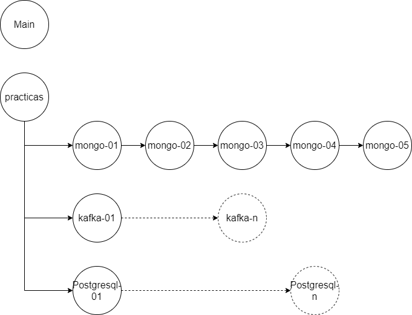

# Tech Pengüin
"Kataller" sobre dockers.

El objetivo del taller es familiarizarno con el uso de contenedores en un entorno local y como pueden ayudarnos tanto en el desarrollo, como desde un punto de vista de sistemas.

La forma de realizarlo es a modo "kata" por eso lo llamamos "kataller" ;-)

Se dispone de un resumen teorico sobre contenedores [Docker Teoria](./Docker_teoria.md).

## Requerimientos 

- Docker
  - Windows: [Docker desktop 4.28+](https://docs.docker.com/desktop/install/windows-install/)
  - [Linux Docker](https://docs.docker.com/engine/install/)
- Cliente git
- IDE Desarrollo [Visual Studio code](https://code.visualstudio.com/download) u otro IDE pero en el curso se trabajara con VS code.

## Practicas

Para realizar algunas de las practicas se han empleado una serie de guías de [Open Liberty](https://openliberty.io).

- https://openliberty.io/guides/mongodb-intro.html
- https://openliberty.io/guides/microprofile-reactive-messaging.html

El ejemplo de PostgreSQL.

- https://www.postgresqltutorial.com/postgresql-getting-started/load-postgresql-sample-database/

## Estructura de ramas

Posicionándonos en la rama `practicas` se dispondrá de un guion de cada una de las practicas.

Por ejemplo posicionándonos en la rama `mongo-01` se podrá comenzar con un entorno inicial para realizar la practica. Las practicas serán graduales incrementando en cada paso una tarea, la solución final de la tarea 1 estará en la rama siguiente es decir mongo-2, la solución de la tarea 2 estará en la rama `mongo-03` y así sucesivamente.

## Practica 1 - Mongo

El objetivo de la practica es conectar desde una aplicación java arrancada en un servidor de aplicaciones java Open Liberty a una BBDD mongo.

Para realizar una gestión mas sencilla del entorno se creara un fichero `docker-compose.yml` con el cual poder arrancar tanto la BBDD mongo con la aplicación en modo "desarrollador" e ir modificándola para ver como funciona.

## Practica 2 - Kafka

El objetivo de la practica es conectar desde una aplicación java arrancada en un servidor de aplicaciones java Open Liberty a un broker de Kafka.

Para realizar una gestión mas sencilla del entorno se creara un fichero `docker-compose.yml` con el cual poder arrancar tanto el broker de Kafka con la aplicación en modo "desarrollador" e ir modificándola para ver como funciona.

