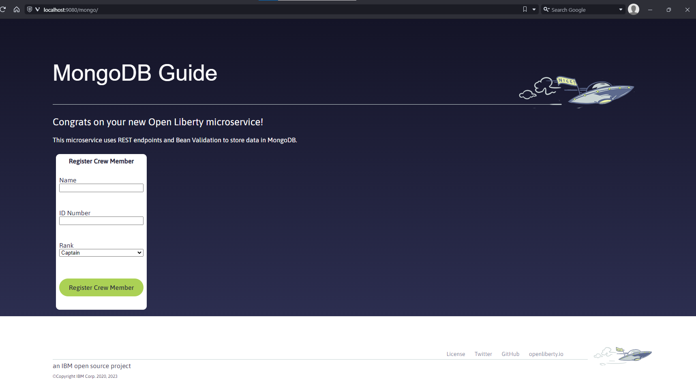

# TECH PENGUIN - KATALLER DOCKERS


## Practica 1 - Mongo


El objetivo de la practica es conectar desde una aplicación java arrancada en un servidor de aplicaciones java Open Liberty a una BBDD mongo.

Para realizar una gestión mas sencilla del entorno se creara un fichero `docker-compose.yml` con el cual poder arrancar tanto la BBDD mongo con la aplicación en modo "desarrollador" e ir modificándola para ver como funciona.


> **NOTA:** se ha utilizado como referencia para la practica la guía de open liberty [mongodb-intro.html](https://openliberty.io/guides/mongodb-intro.html) 


### 01. Revisión del proyecto

La estructura del proyecto debe ser la siguiente

```
TECH_PENGUIN\PRACTICAS\JAVA\MONGODB
+---assets
+---finish
|   \---src
|       +---main
|       |   +---java
|       |   |   \---io
|       |   |       \---openliberty
|       |   |           \---guides
|       |   |               +---application
|       |   |               \---mongo
|       |   +---liberty
|       |   |   \---config
|       |   |       \---resources
|       |   |           \---security
|       |   \---webapp
|       |       +---css
|       |       +---fonts
|       |       +---img
|       |       +---js
|       |       +---META-INF
|       |       \---WEB-INF
|       \---test
|           \---java
|               \---it
|                   \---io
|                       \---openliberty
|                           \---guides
|                               \---application
+---scripts
\---start
    \---src
        +---main
        |   +---java
        |   |   \---io
        |   |       \---openliberty
        |   |           \---guides
        |   |               +---application
        |   |               \---mongo
        |   +---liberty
        |   |   \---config
        |   |       \---resources
        |   |           \---security
        |   \---webapp
        |       +---css
        |       +---fonts
        |       +---img
        |       +---js
        |       +---META-INF
        |       \---WEB-INF
        \---test
            \---java
                \---it
                    \---io
                        \---openliberty
                            \---guides
                                \---application

\tech_penguin\practicas\java>
```


El contenido de las carpetas es el siguiente

- **assest**

  Ficheros de configuración necesarios para inicializar la BBDD Mongo

- **finish**

  Ejemplo original resuelto.

- **scripts**

  Scripts del ejemplo original.

- **start**

  Ficheros sobre los que trabajaremos.

- **test**

  Tests del ejemplo original.


### 02. Preparar la imagen de mongo

Lo primero que se debe hacer es preparar la imagen de mongo. Para ello se debe tener docker arrancado en el equipo local.


Desde un terminal hay que posicionarse en el directorio `practicas\java\mongodb\`


Mediante los comando `docker ps` o `docker images` se puede comprobar si el daemon esta ejecutándose. De ser así no mostrara los contenedores ejecutándose y las imágenes de contenedores disponibles en el sistema respectivamente. Ejemplo en [Ejemplos de salidas de comandos - contenedores en ejecucion](#contenedores-en-ejecución).


Se ejecutan los siguientes comandos, el primero para compilar la imagen y el segundo para arrancar el contenedor.

> **NOTA:** La primera vez tardara porque debe descargarse las imágenes base.

```
docker build -t tech-penguin-mongodb -f assets/Dockerfile .
docker run --name tech-penguin-mongodb-1 -p 27017:27017 -d tech-penguin-mongodb
```

Ejemplos en 

[Ejemplos de salidas de comandos - Compilar imagen mongo](#compilar-imagen-mongo)

[Ejemplos de salidas de comandos - Imágenes de contenedores después de compilar](#imágenes-de-contenedores-después-de-compilar).

[Ejemplos de salidas de comandos -Contenedor de mongo ejecutándose](#contenedor-de-mongo-ejecutándose).


Revisamos el log de ejecución del mongo para ello se entra dentro del contenedor arrancado.

```
docker exec -ti tech-penguin-mongodb-1 bash
```

```
\tech_penguin\java\mongoDB\guide-mongodb-intro\tmp_libs>docker exec -ti tech-penguin-mongodb-1 bash
root@c23769513e8b:/#
```


Una vez dentro se revisa el comienzo del fichero de log

```
head -50 /home/mongodb/logs/mongodb.log
```

[Ejemplos de salidas de comandos -Log de arranque de mongo](#log-de-arranque-de-mongo).


Se debe obtener el certificado TLS generado (`truststore.p12`) para poder conectarse desde la aplicación.

Desde un terminal hay que posicionarse en el directorio `practicas\java\mongodb\`

```
docker cp tech-penguin-mongodb-1:/home/mongodb/certs/truststore.p12 start/src/main/liberty/config/resources/security
docker cp tech-penguin-mongodb-1:/home/mongodb/certs/truststore.p12 finish/src/main/liberty/config/resources/security
docker cp tech-penguin-mongodb-1:/home/mongodb/certs/truststore.p12 certs/
```

[Ejemplos de salidas de comandos -Extracción de certificado TLS](#extracción-de-certificado-tls).


### 03. Ejecutar entorno en modo desarrollador


Se parte del supuesto que **NO se dispone de maven** instalado en el sistema. Para poder disponer de un entorno maven se va crear un contenedor con las características necesarias para poder realizar el ejemplo.


Se crea un fichero llamado `Dockerfile_start` en el directorio `assets`

**Dockerfile_start**

```
FROM maven:3.9.6-ibm-semeru-11-focal

WORKDIR /home/openliberty

# Create the directories.
COPY start/ /home/openliberty/

# Start application
CMD ["mvn", "liberty:dev"]
```


En un terminal nuevo se compila la imagen.

> **NOTA:** La primera vez tardara porque debe descargarse las imágenes base.

```
docker build -t tech-penguin-mongo-app -f assets/Dockerfile_start .
```

Mediante el comando `docker images` se puede comprobar la creación de la imagen.


Se ejecuta el contenedor.

> **NOTA:**  Se debe ajustar el path del volumen a montar.

```
docker run --rm --name tech-penguin-mongo-app-1 -v practicas\java\mongodb\start:/home/openliberty/ -p 9080:9080 tech-penguin-mongo-app
```


[Ejemplos de salidas de comandos - Arranque servidor Open Liberty](#arranque-servidor-open-liberty).


### 04. Crear docker-compose

Como ya se disponen como mínimo de dos terminales, uno para el contenedor mongo y otro para el entorno de desarrollo. Se crea un fichero `docker-compose.yml` que nos permita gestionar el entorno de un forma sencilla.


**docker-compose.yml**

```
#################################################################################
#
# docker-compose para probar como conectar una aplicacion java a mongodb.
#
#
# v0.1
# Latest updated: 2024-04-12
#
#################################################################################

version: '3'

networks:
  tech-penguin-net:
    driver: bridge

services:  
  
##########
## BBDD ##
##########
  tech-penguin-mongodb:
    build:
      context: .
      dockerfile: assets/Dockerfile
    image: tech-penguin-mongodb
    container_name: tech-penguin-mongodb-1
    networks:
      - tech-penguin-net
    ports:
      - 27017:27017

###########
## APP ##
###########
  
  tech-penguin-mongo-app:
    build:
      context: .
      dockerfile: assets/Dockerfile_start
    image: tech-penguin-mongo-app
    container_name: tech-penguin-mongo-app-1
    networks:
      - tech-penguin-net
    ports:
      - 9080:9080
    volumes:
      - ./start:/home/openliberty/
```


### 05. Modificar aplicación

Vamos a proceder a modificar la aplicación para conectar la aplicación java a la BBDD mongo.


Se copia el fichero `finish/src/main/java/io/openliberty/guides/mongo/MongoProducer.java` en `start/src/main/java/io/openliberty/guides/mongo/MongoProducer.java`

Una vez copiado el fichero lo modificamos para ver la importancia de tener acceso al código.

```
public MongoClient createMongo() throws SSLException {
        // tag::decode[]
        String password = PasswordUtil.passwordDecode(encodedPass);
        // end::decode[]
        // tag::createCredential[]
        MongoCredential creds = MongoCredential.createCredential(
                user,
                dbName,
                password.toCharArray()
        );
        // end::createCredential[]

        // tag::sslContext[]
        SSLContext sslContext = JSSEHelper.getInstance().getSSLContext(
                // tag::outboundSSLContext[]
                "outboundSSLContext",
                // end::outboundSSLContext[]
                Collections.emptyMap(),
                null
        );
        // end::sslContext[]
```


En la línea 74 añadimos el siguiente fragmento de código

```
        // A modo curiosidad mostramos la password de la BBDD Mongo
        System.out.println("MongoDB password: " + password);
```


La clase debería quedar así.

```
public MongoClient createMongo() throws SSLException {
        // tag::decode[]
        String password = PasswordUtil.passwordDecode(encodedPass);
        // end::decode[]
        // tag::createCredential[]
        MongoCredential creds = MongoCredential.createCredential(
                user,
                dbName,
                password.toCharArray()
        );
        // end::createCredential[]

        // A modo curiosidad mostramos la password de la BBDD Mongo
        System.out.println("MongoDB password: " + password);

        // tag::sslContext[]
        SSLContext sslContext = JSSEHelper.getInstance().getSSLContext(
                // tag::outboundSSLContext[]
                "outboundSSLContext",
                // end::outboundSSLContext[]
                Collections.emptyMap(),
                null
        );
        // end::sslContext[]
```


Se copia el fichero `finish/src/main/java/io/openliberty/guides/application/CrewService.java` en `start/src/main/java/io/openliberty/guides/application/CrewService.java`

Este fichero es con el que se generan los endpoints de la API


Se copia el fichero `finish/src/main/webapp/META-INF/microprofile-config.properties` en `start/src/main/webapp/META-INF/microprofile-config.properties`


Se remplazar el fichero `start/src/main/liberty/config/server.xml` por este `start/src/main/liberty/config/server.xml`

**server.xml**

```
<server description="Sample Liberty server">
    <!-- tag::featureManager[] -->
    <featureManager>
        <!-- tag::cdiFeature[] -->
        <feature>cdi-4.0</feature>
        <!-- end::cdiFeature[] -->
        <!-- tag::sslFeature[] -->
        <feature>ssl-1.0</feature>
        <!-- end::sslFeature[] -->
        <!-- tag::mpConfigFeature[] -->
        <feature>mpConfig-3.1</feature>
        <!-- end::mpConfigFeature[] -->
        <!-- tag::passwordUtilFeature[] -->
        <feature>passwordUtilities-1.1</feature>
        <!-- end::passwordUtilFeature[] -->
        <feature>beanValidation-3.0</feature>	   
        <feature>restfulWS-3.1</feature>
        <feature>jsonb-3.0</feature>
        <feature>mpOpenAPI-3.1</feature>
    </featureManager>
    <!-- end::featureManager[] -->

    <variable name="http.port" defaultValue="9080"/>
    <variable name="https.port" defaultValue="9443"/>
    <variable name="app.context.root" defaultValue="/mongo"/>

    <!-- tag::httpEndpoint[] -->
    <httpEndpoint
        host="*" 
        httpPort="${http.port}" 
        httpsPort="${https.port}" 
        id="defaultHttpEndpoint"
    />
    <!-- end::httpEndpoint[] -->

    <!-- tag::webApplication[] -->
    <webApplication 
        location="guide-mongodb-intro.war" 
        contextRoot="${app.context.root}"
    />
    <!-- end::webApplication[] -->
    <!-- tag::sslContext[] -->
    <!-- tag::keyStore[] -->
    <keyStore
        id="outboundTrustStore" 
        location="${server.output.dir}/resources/security/truststore.p12"
        password="mongodb"
        type="PKCS12" 
    />
    <!-- end::keyStore[] -->
    <!-- tag::ssl[] -->
    <ssl 
        id="outboundSSLContext" 
        keyStoreRef="defaultKeyStore" 
        trustStoreRef="outboundTrustStore" 
        sslProtocol="TLS" 
    />
    <!-- end::ssl[] -->
    <!-- end::sslContext[] -->
</server>

```


Cuando se modifique la configuración del servidor Open Liberty detectara las nuevas características.

```
tech-penguin-mongo-app-1  | [INFO] Copied file: /home/openliberty/src/main/liberty/config/server.xml to: /tmp/tempConfig14203631299352621759/server.xml
tech-penguin-mongo-app-1  | [INFO] Configuration features have been added: [mpopenapi-3.1, jsonb-3.0, ssl-1.0, passwordutilities-1.1, restfulws-3.1, beanvalidation-3.0, cdi-4.0]
tech-penguin-mongo-app-1  | [INFO] Running liberty:install-feature
```

y procederá a instalar y configurarlas

```
tech-penguin-mongo-app-1  | All features were successfully verified.
tech-penguin-mongo-app-1  | [INFO] Installing features: [mpopenapi-3.1, mpconfig-3.1, jsonb-3.0, ssl-1.0, passwordutilities-1.1, restfulws-3.1, beanvalidation-3.0, cdi-4.0]
```


Se prueba la aplicación accediendo a la URL

```
http://localhost:9080/openapi/ui/
```


Inicialmente no cargara hasta que no tengamos el siguiente mensaje en el servidor 

```
tech-penguin-mongo-app-1  | [INFO]
tech-penguin-mongo-app-1  | [INFO] [AUDIT   ] CWPKI0820A: The default keystore has been created using the 'keystore_password' environment variable.
tech-penguin-mongo-app-1  | [INFO] [AUDIT   ] CWPKI0803A: SSL certificate created in 7.859 seconds. SSL key file: /home/openliberty/target/liberty/wlp/usr/servers/defaultServer/resources/security/key.p12
tech-penguin-mongo-app-1  | [INFO] [AUDIT   ] CWWKS4104A: LTPA keys created in 7.893 seconds. LTPA key file: /home/openliberty/target/liberty/wlp/usr/servers/defaultServer/resources/security/ltpa.keys
tech-penguin-mongo-app-1  | [INFO] [AUDIT   ] CWWKG0017I: The server configuration was successfully updated in 64.508 seconds.
tech-penguin-mongo-app-1  | [INFO] [AUDIT   ] CWWKF1037I: The server added the [appSecurity-5.0, beanValidation-3.0, cdi-4.0, distributedMap-1.0, expressionLanguage-5.0, jndi-1.0, jsonb-3.0, jsonp-2.1, mpOpenAPI-3.1, passwordUtilities-1.1, restfulWS-3.1, restfulWSClient-3.1, servlet-6.0, ssl-1.0, transportSecurity-1.0] features to the existing feature set.
tech-penguin-mongo-app-1  | [INFO] [AUDIT   ] CWWKF0012I: The server installed the following features: [appSecurity-5.0, beanValidation-3.0, cdi-4.0, distributedMap-1.0, expressionLanguage-5.0, jndi-1.0, jsonb-3.0, jsonp-2.1, mpConfig-3.1, mpOpenAPI-3.1, passwordUtilities-1.1, restfulWS-3.1, restfulWSClient-3.1, servlet-6.0, ssl-1.0, transportSecurity-1.0].
tech-penguin-mongo-app-1  | [INFO] [AUDIT   ] CWWKF0008I: Feature update completed in 64.916 seconds.
tech-penguin-mongo-app-1  | [INFO] [AUDIT   ] CWWKT0016I: Web application available (default_host): http://1a924dec7ccc:9080/openapi/ui/
tech-penguin-mongo-app-1  | [INFO] [AUDIT   ] CWWKT0016I: Web application available (default_host): http://1a924dec7ccc:9080/openapi/
tech-penguin-mongo-app-1  | [INFO] [AUDIT   ] CWWKZ0022W: Application guide-mongodb-intro has not started in 30.063 seconds.
tech-penguin-mongo-app-1  | [INFO] [AUDIT   ] CWWKF0008I: Feature update completed in 64.916 seconds.
tech-penguin-mongo-app-1  | [INFO] [AUDIT   ] CWWKT0016I: Web application available (default_host): http://1a924dec7ccc:9080/openapi/ui/
tech-penguin-mongo-app-1  | [INFO] [AUDIT   ] CWWKT0016I: Web application available (default_host): http://1a924dec7ccc:9080/openapi/
tech-penguin-mongo-app-1  | [INFO] [AUDIT   ] CWWKZ0022W: Application guide-mongodb-intro has not started in 30.063 seconds.
tech-penguin-mongo-app-1  | [INFO] [AUDIT   ] CWWKT0016I: Web application available (default_host): http://1a924dec7ccc:9080/mongo/
tech-penguin-mongo-app-1  | [INFO] [AUDIT   ] CWWKZ0001I: Application guide-mongodb-intro started in 119.380 seconds.

```


Accedemos a la pagina principal

```
http://localhost:9080/mongo
```



**Atencion al mensaje de la password!!**

```
tech-penguin-mongo-app-1  | [INFO] [AUDIT   ] CWWKZ0001I: Application guide-mongodb-intro started in 119.380 seconds.
tech-penguin-mongo-app-1  | [INFO] MongoDB password: openliberty
tech-penguin-mongo-app-1  | [INFO] [WARNING ] SLF4J not found on the classpath.  Logging is disabled for the 'org.mongodb.driver' component
```


Se procede a realizar unas operaciones CRUD desde el sawgger de OpenAPI en http://localhost:9080/openapi/ui/

- CREAR

  


en la seccion del `Request body` se pone y se pulsa `execute`

```
{
  "name": "Member1",
  "rank": "Officer",
  "crewID": "000001"
}
```


Dara un error 500 y en la consola del servidor dara estos mensajes

```
tech-penguin-mongo-app-1  | [INFO] com.mongodb.MongoTimeoutException: Timed out while waiting for a server that matches ReadPreferenceServerSelector{readPreference=primary}. Client view of cluster state is {type=UNKNOWN, servers=[{address=localhost:27017, type=UNKNOWN, state=CONNECTING, exception={com.mongodb.MongoSocketOpenException: Exception opening socket}, caused by {java.net.ConnectException: Connection refused (Connection refused)}}]
tech-penguin-mongo-app-1  | [INFO]      at com.mongodb.internal.connection.BaseCluster.createAndLogTimeoutException(BaseCluster.java:392)
tech-penguin-mongo-app-1  | [INFO]      at com.mongodb.internal.connection.BaseCluster.selectServer(BaseCluster.java:148)
tech-penguin-mongo-app-1  | [INFO]      at com.mongodb.internal.connection.SingleServerCluster.selectServer(SingleServerCluster.java:46)
tech-penguin-mongo-app-1  | [INFO]      at com.mongodb.internal.binding.ClusterBinding.getReadConnectionSource(ClusterBinding.java:108)
tech-penguin-mongo-app-1  | [INFO]      at com.mongodb.client.internal.ClientSessionBinding.getConnectionSource(ClientSessionBinding.java:128)
tech-penguin-mongo-app-1  | [INFO]      at com.mongodb.client.internal.ClientSessionBinding.getReadConnectionSource(ClientSessionBinding.java:92)
tech-penguin-mongo-app-1  | [INFO]      at com.mongodb.internal.operation.SyncOperationHelper.withSuppliedResource(SyncOperationHelper.java:141)
tech-penguin-mongo-app-1  | [INFO]      at com.mongodb.internal.operation.SyncOperationHelper.withSourceAndConnection(SyncOperationHelper.java:122)
tech-penguin-mongo-app-1  | [INFO]      at com.mongodb.internal.operation.FindOperation.lambda$execute$2(FindOperation.java:310)
tech-penguin-mongo-app-1  | [INFO]      at com.mongodb.internal.operation.SyncOperationHelper.lambda$decorateReadWithRetries$12(SyncOperationHelper.java:289)
tech-penguin-mongo-app-1  | [INFO]      at com.mongodb.internal.async.function.RetryingSyncSupplier.get(RetryingSyncSupplier.java:67)
tech-penguin-mongo-app-1  | [INFO]      at com.mongodb.internal.operation.FindOperation.execute(FindOperation.java:321)
tech-penguin-mongo-app-1  | [INFO]      at com.mongodb.internal.operation.FindOperation.execute(FindOperation.java:71)
tech-penguin-mongo-app-1  | [INFO]      at com.mongodb.client.internal.MongoClientDelegate$DelegateOperationExecutor.execute(MongoClientDelegate.java:153)
tech-penguin-mongo-app-1  | [INFO]      at com.mongodb.client.internal.MongoIterableImpl.execute(MongoIterableImpl.java:130)
tech-penguin-mongo-app-1  | [INFO]      at com.mongodb.client.internal.MongoIterableImpl.iterator(MongoIterableImpl.java:90)
tech-penguin-mongo-app-1  | [INFO]      at io.openliberty.guides.application.CrewService.retrieve(CrewService.java:155)
tech-penguin-mongo-app-1  | [INFO]      at io.openliberty.guides.application.CrewService$Proxy$_$$_WeldClientProxy.retrieve(Unknown Source)
tech-penguin-mongo-app-1  | [INFO]      at jdk.internal.reflect.GeneratedMethodAccessor878.invoke(Unknown Source)
tech-penguin-mongo-app-1  | [INFO]      at java.base/java.lang.reflect.Method.invoke(Method.java:572)
tech-penguin-mongo-app-1  | [INFO]      at org.jboss.resteasy.core.MethodInjectorImpl.invoke(MethodInjectorImpl.java:170)
tech-penguin-mongo-app-1  | [INFO]      at [internal classes]
tech-penguin-mongo-app-1  | [INFO]      at org.jboss.resteasy.core.ResourceMethodInvoker.lambda$invokeOnTarget$2(ResourceMethodInvoker.java:474)
tech-penguin-mongo-app-1  | [INFO]      at org.jboss.resteasy.core.interception.jaxrs.PreMatchContainerRequestContext.filter(PreMatchContainerRequestContext.java:434)
tech-penguin-mongo-app-1  | [INFO]      at [internal classes]
tech-penguin-mongo-app-1  | [INFO]      at org.jboss.resteasy.core.SynchronousDispatcher.lambda$invoke$4(SynchronousDispatcher.java:261)
tech-penguin-mongo-app-1  | [INFO]      at org.jboss.resteasy.core.SynchronousDispatcher.lambda$preprocess$0(SynchronousDispatcher.java:161)
tech-penguin-mongo-app-1  | [INFO]      at org.jboss.resteasy.core.interception.jaxrs.PreMatchContainerRequestContext.filter(PreMatchContainerRequestContext.java:434)
tech-penguin-mongo-app-1  | [INFO]      at [internal classes]
tech-penguin-mongo-app-1  | [INFO]      at jakarta.servlet.http.HttpServlet.service(HttpServlet.java:614)
tech-penguin-mongo-app-1  | [INFO]      at com.ibm.ws.webcontainer.servlet.ServletWrapper.service(ServletWrapper.java:1260)
tech-penguin-mongo-app-1  | [INFO]      at [internal classes]
tech-penguin-mongo-app-1  | [INFO]      at java.base/java.util.concurrent.ThreadPoolExecutor.runWorker(ThreadPoolExecutor.java:1128)
tech-penguin-mongo-app-1  | [INFO]      at java.base/java.util.concurrent.ThreadPoolExecutor$Worker.run(ThreadPoolExecutor.java:628)
tech-penguin-mongo-app-1  | [INFO]      at java.base/java.lang.Thread.run(Thread.java:839)
tech-penguin-mongo-app-1  | [INFO] [ERROR   ] RESTEASY002375: Error processing request POST /mongo/api/crew - io.openliberty.guides.application.CrewService.add
tech-penguin-mongo-app-1  | [INFO] Timed out while waiting for a server that matches WritableServerSelector. Client view of cluster state is {type=UNKNOWN, servers=[{address=localhost:27017, type=UNKNOWN, state=CONNECTING, exception={com.mongodb.MongoSocketOpenException: Exception opening socket}, caused by {java.net.ConnectException: Connection refused (Connection refused)}}]
```


El motivo que indica es que la BBDD rechaza la conexión, pero realmente el motivo es que al estar la aplicación ejecutándose dentro de una contenedor es que dentro del mismo no existe un servicio mongo ejecutándose en el puerto 27017.


Modifiquemos el host de conexión en la aplicación. Para ello se debe modificar la el fichero `start/src/main/webapp/META-INF/microprofile-config.properties`

Como los contenedores se están ejecutando en un docker compose nos vale con cambiar `localhost`por el nombre del servicio de la BBDD Mongo, es decir, `tech-penguin-mongodb` en la propiedad `mongo.hostname`

```
mongo.hostname=tech-penguin-mongodb
# end::hostname[]
# tag::port[]
mongo.port=27017
# end::port[]
# tag::dbname[]
mongo.dbname=testdb
# end::dbname[]
# tag::mongoUser[]
mongo.user=sampleUser
# end::mongoUser[]
# tag::passEncoded[]
mongo.pass.encoded={aes}APtt+/vYxxPa0jE1rhmZue9wBm3JGqFK3JR4oJdSDGWM1wLr1ckvqkqKjSB2Voty8g==
# tag::passEncoded[]
```


Al guardar el fichero se recarga la configuracion.

```
tech-penguin-mongo-app-1  | [INFO] [AUDIT   ] CWWKT0017I: Web application removed (default_host): http://1a924dec7ccc:9080/mongo/
tech-penguin-mongo-app-1  | [INFO] [AUDIT   ] CWWKZ0009I: The application guide-mongodb-intro has stopped successfully.
tech-penguin-mongo-app-1  | [INFO] [AUDIT   ] CWWKT0016I: Web application available (default_host): http://1a924dec7ccc:9080/mongo/
tech-penguin-mongo-app-1  | [INFO] [AUDIT   ] CWWKZ0003I: The application guide-mongodb-intro updated in 8.526 seconds.
```


Si se vuelve a intentar la operacion de crear desde OpenAPI (desde la ventana del navegador) pulsando de nuevo `execute`

Nos dará el siguiente mensaje en el log del servidor

```
tech-penguin-mongo-app-1  | [INFO] [ERROR   ] CWPKI0824E: SSL HANDSHAKE FAILURE:  Host name verification error while connecting to host [tech-penguin-mongodb].  The host name used to access the server does not match the server certificate's SubjectDN or Subject Alternative Name information.  The extended error message from the SSL handshake exception is: [No name matching tech-penguin-mongodb found].
```


Se deben regenerar de nuevo los certificados añadiendo el nombre alternativo en el fichero `assets/Dockerfile`

En la linea 10 se deben añadir el siguiente argumento. 

```
ARG ALT_DNS_NAMES="DNS.1:tech-penguin-mongodb,DNS.2:localhost"
```

Y en la linea 17 las dos siguientes.

```
    -addext "subjectAltName=$ALT_DNS_NAMES" \
    -sha256
```


El fichero `assets/Dockerfile` deberia quedar asi.

```
FROM icr.io/appcafe/ibm-semeru-runtimes:open-11-jdk-ubi as staging

# Define the variables for the OpenSSL subject.
ARG COUNTRY=CA
ARG STATE=Ontario
ARG LOCALITY=Markham
ARG ORG=IBM
ARG UNIT=OpenLiberty
ARG COMMON_NAME=localhost
ARG ALT_DNS_NAMES="DNS.1:tech-penguin-mongodb,DNS.2:localhost"

# Generate a self-signed certificate and private key.
RUN openssl req -x509 -newkey rsa:2048 -nodes -days 365 \
    -out /tmp/cert.pem \
    -keyout /tmp/private.key \
    -subj "/C=$COUNTRY/ST=$STATE/L=$LOCALITY/O=$ORG/OU=$UNIT/CN=$COMMON_NAME" \
    -addext "subjectAltName=$ALT_DNS_NAMES" \
    -sha256

# Combine the self-signed certificate and private key.
RUN cat /tmp/private.key /tmp/cert.pem > /tmp/mongodb_tls.pem

# Import combined file to truststore.
RUN keytool -import -trustcacerts -keystore /tmp/truststore.p12 \
    -storepass mongodb -storetype PKCS12 -alias mongo -file /tmp/cert.pem -noprompt

FROM mongo:latest

# Create the directories.
RUN mkdir /home/mongodb
RUN mkdir /home/mongodb/data
RUN mkdir /home/mongodb/certs
RUN mkdir /home/mongodb/logs
RUN chown -R mongodb:mongodb /home/mongodb

# Copy the certificates over from stage one.
COPY --from=staging /tmp /home/mongodb/certs

# Copy the configuration and setup files from
# the host machine to the image.
COPY assets/mongodb.conf /home/mongodb
COPY assets/index.js /home/mongodb

# Run MongodDB daemon and execute the setup script.
RUN mongod \
        --fork \
        --config /home/mongodb/mongodb.conf \
    && mongosh \
        testdb \
        -tls \
        --tlsCAFile /home/mongodb/certs/cert.pem \
        --tlsCertificateKeyFile: /home/mongodb/certs/mongodb_tls.pem \
        --host localhost \
        /home/mongodb/index.js \
    && mongod --dbpath /home/mongodb/data --shutdown \
    && chown -R mongodb /home/mongodb

# Start MongoDB daemon when the image is run in a container.
CMD ["mongod", "--config", "/home/mongodb/mongodb.conf"]

```


Se regenera la imagen de mongo

```
docker compose build tech-penguin-mongodb
```

Se arranca la BBDD mongo

```
docker compose up tech-penguin-mongodb -d
```

Copiamos los nuevos certificados en local

```
docker cp tech-penguin-mongodb-1:/home/mongodb/certs/cert.pem certs/cert.crt
docker cp tech-penguin-mongodb-1:/home/mongodb/certs/mongodb_tls.pem certs/mongodb_tls.key
docker cp tech-penguin-mongodb-1:/home/mongodb/certs/truststore.p12 start/src/main/liberty/config/resources/security
docker cp tech-penguin-mongodb-1:/home/mongodb/certs/truststore.p12 finish/src/main/liberty/config/resources/security
```

Se para todo el entorno

```
docker compose stop
```

Y se vuelve a arrancar

```
docker compose up
```


Se vuelve a repetir la operacion de CREAR desde el sawgger de OpenAPI en http://localhost:9080/openapi/ui/


### 06. Añadir Test

Se copia el fichero `finish/src/test/java/it/io/openliberty/guides/application/CrewServiceIT.java` en `start//src/test/java/it/io/openliberty/guides/application/CrewServiceIT.java`


### Incidencias Practica 1 - Mongo

Sección con incidencias que nos podemos encontrar.


### Ejemplos de salidas de comandos


#### Contenedores en ejecución

```
\tech_penguin\practicas\java\mongodb>docker ps
CONTAINER ID   IMAGE     COMMAND   CREATED   STATUS    PORTS     NAMES

\tech_penguin\practicas\java\mongodb>
```


#### Compilar imagen mongo

```
\tech_penguin\practicas\java\mongodb>docker build -t tech-penguin-mongodb -f assets/Dockerfile .
[+] Building 4.1s (20/20) FINISHED                                                                                                                                                                                          docker:default
 => [internal] load build definition from Dockerfile                                                                                                                                                                                  0.1s
 => => transferring dockerfile: 1.90kB                                                                                                                                                                                                0.0s
 => [internal] load metadata for docker.io/library/mongo:latest                                                                                                                                                                       1.3s
 => [internal] load metadata for icr.io/appcafe/ibm-semeru-runtimes:open-11-jdk-ubi                                                                                                                                                   0.8s
 => [internal] load .dockerignore                                                                                                                                                                                                     0.3s
 => => transferring context: 2B                                                                                                                                                                                                       0.0s
 => [stage-1  1/10] FROM docker.io/library/mongo:latest@sha256:5505a38a8c6044ace154376dfe4c94ac85f01c22585547efdd9483c4922dfa37                                                                                                       0.0s
 => [internal] load build context                                                                                                                                                                                                     0.1s
 => => transferring context: 675B                                                                                                                                                                                                     0.0s
 => [staging 1/4] FROM icr.io/appcafe/ibm-semeru-runtimes:open-11-jdk-ubi@sha256:6d3e1e34bd57ae000fa905918284055ba0fb2fdd41cf2ec4468ee388aa8c5725                                                                                     0.0s
 => CACHED [stage-1  2/10] RUN mkdir /home/mongodb                                                                                                                                                                                    0.0s
 => CACHED [stage-1  3/10] RUN mkdir /home/mongodb/data                                                                                                                                                                               0.0s
 => CACHED [stage-1  4/10] RUN mkdir /home/mongodb/certs                                                                                                                                                                              0.0s
 => CACHED [stage-1  5/10] RUN mkdir /home/mongodb/logs                                                                                                                                                                               0.0s
 => CACHED [stage-1  6/10] RUN chown -R mongodb:mongodb /home/mongodb                                                                                                                                                                 0.0s
 => CACHED [staging 2/4] RUN openssl req -x509 -newkey rsa:2048 -nodes -days 365     -out /tmp/cert.pem     -keyout /tmp/private.key     -subj "/C=CA/ST=Ontario/L=Markham/O=IBM/OU=OpenLiberty/CN=localhost"                         0.0s
 => CACHED [staging 3/4] RUN cat /tmp/private.key /tmp/cert.pem > /tmp/mongodb_tls.pem                                                                                                                                                0.0s
 => CACHED [staging 4/4] RUN keytool -import -trustcacerts -keystore /tmp/truststore.p12     -storepass mongodb -storetype PKCS12 -alias mongo -file /tmp/cert.pem -noprompt                                                          0.0s
 => CACHED [stage-1  7/10] COPY --from=staging /tmp /home/mongodb/certs                                                                                                                                                               0.0s
 => CACHED [stage-1  8/10] COPY assets/mongodb.conf /home/mongodb                                                                                                                                                                     0.0s
 => CACHED [stage-1  9/10] COPY assets/index.js /home/mongodb                                                                                                                                                                         0.0s
 => CACHED [stage-1 10/10] RUN mongod         --fork         --config /home/mongodb/mongodb.conf     && mongosh         testdb         -tls         --tlsCAFile /home/mongodb/certs/cert.pem         --tlsCertificateKeyFile: /home/  0.0s
 => exporting to image                                                                                                                                                                                                                0.0s
 => => exporting layers                                                                                                                                                                                                               0.0s
 => => writing image sha256:530b0042757040a4aa0a29981367330cb9fcf7d6334edd979d2ac20c3705ee6d                                                                                                                                          0.0s
 => => naming to docker.io/library/tech-penguin-mongodb                                                                                                                                                                               0.0s

View build details: docker-desktop://dashboard/build/default/default/1k5qp3e1eissqlhrslmgqrx43

What's Next?
  View a summary of image vulnerabilities and recommendations → docker scout quickview

\tech_penguin\practicas\java\mongodb>
```


#### Imágenes de contenedores después de compilar

```
\tech_penguin\practicas\java\mongodb>docker images
REPOSITORY                                TAG                         IMAGE ID       CREATED         SIZE
tech-penguin-mongodb                      latest                      530b00427570   32 hours ago    1.09GB
docker/desktop-vpnkit-controller          v2.0                        8c2c38aa676e   2 years ago     21MB
docker/desktop-storage-provisioner        v2.0                        99f89471f470   2 years ago     41.9MB
eclipse/che-ip                            latest                      ba0c46d33f01   5 years ago     4.82MB

\tech_penguin\practicas\java\mongodb>
```


#### Contenedor de mongo ejecutándose

```  
\tech_penguin\practicas\java\mongodb>docker run --name tech-penguin-mongodb-1 -p 27017:27017 tech-penguin-mongodb
{"t":{"$date":"2024-04-07T19:52:32.990Z"},"s":"I",  "c":"CONTROL",  "id":20697,   "ctx":"main","msg":"Renamed existing log file","attr":{"oldLogPath":"/home/mongodb/logs/mongodb.log","newLogPath":"/home/mongodb/logs/mongodb.log.2024-04-07T19-52-32"}}
```


#### Log de arranque de mongo

```
root@c23769513e8b:/# head -100 /home/mongodb/logs/mongodb.log
{"t":{"$date":"2024-04-07T19:52:32.991+00:00"},"s":"I",  "c":"NETWORK",  "id":4915701, "ctx":"main","msg":"Initialized wire specification","attr":{"spec":{"incomingExternalClient":{"minWireVersion":0,"maxWireVersion":21},"incomingInternalClient":{"minWireVersion":0,"maxWireVersion":21},"outgoing":{"minWireVersion":6,"maxWireVersion":21},"isInternalClient":true}}}
{"t":{"$date":"2024-04-07T19:52:32.997+00:00"},"s":"W",  "c":"NETWORK",  "id":551190,  "ctx":"main","msg":"Server certificate has no compatible Subject Alternative Name. This may prevent TLS clients from connecting","tags":["startupWarnings"]}
{"t":{"$date":"2024-04-07T19:52:32.998+00:00"},"s":"I",  "c":"NETWORK",  "id":4913010, "ctx":"main","msg":"Certificate information","attr":{"subject":"CN=localhost,OU=OpenLiberty,O=IBM,L=Markham,ST=Ontario,C=CA","issuer":"CN=localhost,OU=OpenLiberty,O=IBM,L=Markham,ST=Ontario,C=CA","thumbprint":"70752ED825B4953FEBFEB5DB60355A0C2BB8F835","notValidBefore":{"$date":"2024-04-06T11:21:47.000Z"},"notValidAfter":{"$date":"2025-04-06T11:21:47.000Z"},"keyFile":"/home/mongodb/certs/mongodb_tls.pem","type":"Server"}}
{"t":{"$date":"2024-04-07T19:52:32.998+00:00"},"s":"I",  "c":"CONTROL",  "id":23285,   "ctx":"main","msg":"Automatically disabling TLS 1.0, to force-enable TLS 1.0 specify --sslDisabledProtocols 'none'"}
{"t":{"$date":"2024-04-07T19:52:33.000+00:00"},"s":"I",  "c":"NETWORK",  "id":4648601, "ctx":"main","msg":"Implicit TCP FastOpen unavailable. If TCP FastOpen is required, set tcpFastOpenServer, tcpFastOpenClient, and tcpFastOpenQueueSize."}
{"t":{"$date":"2024-04-07T19:52:33.008+00:00"},"s":"I",  "c":"REPL",     "id":5123008, "ctx":"main","msg":"Successfully registered PrimaryOnlyService","attr":{"service":"TenantMigrationDonorService","namespace":"config.tenantMigrationDonors"}}
{"t":{"$date":"2024-04-07T19:52:33.008+00:00"},"s":"I",  "c":"REPL",     "id":5123008, "ctx":"main","msg":"Successfully registered PrimaryOnlyService","attr":{"service":"TenantMigrationRecipientService","namespace":"config.tenantMigrationRecipients"}}
{"t":{"$date":"2024-04-07T19:52:33.008+00:00"},"s":"I",  "c":"CONTROL",  "id":5945603, "ctx":"main","msg":"Multi threading initialized"}
{"t":{"$date":"2024-04-07T19:52:33.008+00:00"},"s":"I",  "c":"TENANT_M", "id":7091600, "ctx":"main","msg":"Starting TenantMigrationAccessBlockerRegistry"}
{"t":{"$date":"2024-04-07T19:52:33.008+00:00"},"s":"I",  "c":"CONTROL",  "id":4615611, "ctx":"initandlisten","msg":"MongoDB starting","attr":{"pid":1,"port":27017,"dbPath":"/home/mongodb/data","architecture":"64-bit","host":"c23769513e8b"}}
{"t":{"$date":"2024-04-07T19:52:33.008+00:00"},"s":"I",  "c":"CONTROL",  "id":23403,   "ctx":"initandlisten","msg":"Build Info","attr":{"buildInfo":{"version":"7.0.8","gitVersion":"c5d33e55ba38d98e2f48765ec4e55338d67a4a64","openSSLVersion":"OpenSSL 3.0.2 15 Mar 2022","modules":[],"allocator":"tcmalloc","environment":{"distmod":"ubuntu2204","distarch":"x86_64","target_arch":"x86_64"}}}}
{"t":{"$date":"2024-04-07T19:52:33.008+00:00"},"s":"I",  "c":"CONTROL",  "id":51765,   "ctx":"initandlisten","msg":"Operating System","attr":{"os":{"name":"Ubuntu","version":"22.04"}}}
{"t":{"$date":"2024-04-07T19:52:33.008+00:00"},"s":"I",  "c":"CONTROL",  "id":21951,   "ctx":"initandlisten","msg":"Options set by command line","attr":{"options":{"config":"/home/mongodb/mongodb.conf","net":{"bindIp":"*","tls":{"CAFile":"/home/mongodb/certs/cert.pem","allowConnectionsWithoutCertificates":true,"certificateKeyFile":"/home/mongodb/certs/mongodb_tls.pem","mode":"requireTLS"}},"storage":{"dbPath":"/home/mongodb/data"},"systemLog":{"destination":"file","path":"/home/mongodb/logs/mongodb.log"}}}}
{"t":{"$date":"2024-04-07T19:52:33.014+00:00"},"s":"I",  "c":"STORAGE",  "id":22270,   "ctx":"initandlisten","msg":"Storage engine to use detected by data files","attr":{"dbpath":"/home/mongodb/data","storageEngine":"wiredTiger"}}
{"t":{"$date":"2024-04-07T19:52:33.014+00:00"},"s":"I",  "c":"STORAGE",  "id":22315,   "ctx":"initandlisten","msg":"Opening WiredTiger","attr":{"config":"create,cache_size=7450M,session_max=33000,eviction=(threads_min=4,threads_max=4),config_base=false,statistics=(fast),log=(enabled=true,remove=true,path=journal,compressor=snappy),builtin_extension_config=(zstd=(compression_level=6)),file_manager=(close_idle_time=600,close_scan_interval=10,close_handle_minimum=2000),statistics_log=(wait=0),json_output=(error,message),verbose=[recovery_progress:1,checkpoint_progress:1,compact_progress:1,backup:0,checkpoint:0,compact:0,evict:0,history_store:0,recovery:0,rts:0,salvage:0,tiered:0,timestamp:0,transaction:0,verify:0,log:0],"}}
{"t":{"$date":"2024-04-07T19:52:33.869+00:00"},"s":"I",  "c":"STORAGE",  "id":4795906, "ctx":"initandlisten","msg":"WiredTiger opened","attr":{"durationMillis":855}}
{"t":{"$date":"2024-04-07T19:52:33.869+00:00"},"s":"I",  "c":"RECOVERY", "id":23987,   "ctx":"initandlisten","msg":"WiredTiger recoveryTimestamp","attr":{"recoveryTimestamp":{"$timestamp":{"t":0,"i":0}}}}
{"t":{"$date":"2024-04-07T19:52:33.888+00:00"},"s":"W",  "c":"CONTROL",  "id":22120,   "ctx":"initandlisten","msg":"Access control is not enabled for the database. Read and write access to data and configuration is unrestricted","tags":["startupWarnings"]}
{"t":{"$date":"2024-04-07T19:52:33.888+00:00"},"s":"W",  "c":"CONTROL",  "id":22178,   "ctx":"initandlisten","msg":"/sys/kernel/mm/transparent_hugepage/enabled is 'always'. We suggest setting it to 'never' in this binary version","tags":["startupWarnings"]}
{"t":{"$date":"2024-04-07T19:52:33.888+00:00"},"s":"W",  "c":"CONTROL",  "id":5123300, "ctx":"initandlisten","msg":"vm.max_map_count is too low","attr":{"currentValue":262144,"recommendedMinimum":1677720,"maxConns":838860},"tags":["startupWarnings"]}
{"t":{"$date":"2024-04-07T19:52:33.898+00:00"},"s":"I",  "c":"NETWORK",  "id":4915702, "ctx":"initandlisten","msg":"Updated wire specification","attr":{"oldSpec":{"incomingExternalClient":{"minWireVersion":0,"maxWireVersion":21},"incomingInternalClient":{"minWireVersion":0,"maxWireVersion":21},"outgoing":{"minWireVersion":6,"maxWireVersion":21},"isInternalClient":true},"newSpec":{"incomingExternalClient":{"minWireVersion":0,"maxWireVersion":21},"incomingInternalClient":{"minWireVersion":21,"maxWireVersion":21},"outgoing":{"minWireVersion":21,"maxWireVersion":21},"isInternalClient":true}}}
{"t":{"$date":"2024-04-07T19:52:33.898+00:00"},"s":"I",  "c":"REPL",     "id":5853300, "ctx":"initandlisten","msg":"current featureCompatibilityVersion value","attr":{"featureCompatibilityVersion":"7.0","context":"startup"}}
{"t":{"$date":"2024-04-07T19:52:33.898+00:00"},"s":"I",  "c":"STORAGE",  "id":5071100, "ctx":"initandlisten","msg":"Clearing temp directory"}
{"t":{"$date":"2024-04-07T19:52:33.901+00:00"},"s":"I",  "c":"CONTROL",  "id":6608200, "ctx":"initandlisten","msg":"Initializing cluster server parameters from disk"}
{"t":{"$date":"2024-04-07T19:52:33.901+00:00"},"s":"I",  "c":"CONTROL",  "id":20536,   "ctx":"initandlisten","msg":"Flow Control is enabled on this deployment"}
{"t":{"$date":"2024-04-07T19:52:33.901+00:00"},"s":"I",  "c":"FTDC",     "id":20625,   "ctx":"initandlisten","msg":"Initializing full-time diagnostic data capture","attr":{"dataDirectory":"/home/mongodb/data/diagnostic.data"}}
{"t":{"$date":"2024-04-07T19:52:33.911+00:00"},"s":"I",  "c":"REPL",     "id":6015317, "ctx":"initandlisten","msg":"Setting new configuration state","attr":{"newState":"ConfigReplicationDisabled","oldState":"ConfigPreStart"}}
{"t":{"$date":"2024-04-07T19:52:33.911+00:00"},"s":"I",  "c":"STORAGE",  "id":22262,   "ctx":"initandlisten","msg":"Timestamp monitor starting"}
{"t":{"$date":"2024-04-07T19:52:33.913+00:00"},"s":"I",  "c":"NETWORK",  "id":23015,   "ctx":"listener","msg":"Listening on","attr":{"address":"/tmp/mongodb-27017.sock"}}
{"t":{"$date":"2024-04-07T19:52:33.913+00:00"},"s":"I",  "c":"NETWORK",  "id":23015,   "ctx":"listener","msg":"Listening on","attr":{"address":"0.0.0.0"}}
{"t":{"$date":"2024-04-07T19:52:33.913+00:00"},"s":"I",  "c":"NETWORK",  "id":23016,   "ctx":"listener","msg":"Waiting for connections","attr":{"port":27017,"ssl":"on"}}
{"t":{"$date":"2024-04-07T19:52:33.913+00:00"},"s":"I",  "c":"CONTROL",  "id":8423403, "ctx":"initandlisten","msg":"mongod startup complete","attr":{"Summary of time elapsed":{"Startup from clean shutdown?":true,"Statistics":{"Transport layer setup":"0 ms","Run initial syncer crash recovery":"0 ms","Create storage engine lock file in the data directory":"0 ms","Get metadata describing storage engine":"0 ms","Validate options in metadata against current startup options":"0 ms","Create storage engine":"866 ms","Write current PID to file":"0 ms","Initialize FCV before rebuilding indexes":"10 ms","Drop abandoned idents and get back indexes that need to be rebuilt or builds that need to be restarted":"0 ms","Rebuild indexes for collections":"0 ms","Load cluster parameters from disk for a standalone":"0 ms","Build user and roles graph":"0 ms","Verify indexes for admin.system.users collection":"0 ms","Set up the background thread pool responsible for waiting for opTimes to be majority committed":"0 ms","Initialize information needed to make a mongod instance shard aware":"0 ms","Start up the replication coordinator":"1 ms","Start transport layer":"0 ms","_initAndListen total elapsed time":"905 ms"}}}}
```


#### Extracción de certificado TLS

```
\tech_penguin\practicas\java\mongodb>docker cp tech-penguin-mongodb-1:/home/mongodb/certs/truststore.p12 certs/
Successfully copied 3.07kB to \tech_penguin\practicas\java\mongodb\certs\

\tech_penguin\practicas\java\mongodb>
```


#### Arranque servidor Open Liberty

```
[INFO] CWWKM2010I: Searching for CWWKF0011I: in /home/openliberty/target/liberty/wlp/usr/servers/defaultServer/logs/messages.log. This search will timeout after 90 seconds.
[INFO] [AUDIT   ] CWWKG0093A: Processing configuration drop-ins resource: /home/openliberty/target/liberty/wlp/usr/servers/defaultServer/configDropins/overrides/liberty-plugin-variable-config.xml
[INFO] [AUDIT   ] CWWKZ0058I: Monitoring dropins for applications.
[INFO] [AUDIT   ] CWWKF0012I: The server installed the following features: [mpConfig-3.1].
[INFO] [AUDIT   ] CWWKF0011I: The defaultServer server is ready to run a smarter planet. The defaultServer server started in 67.108 seconds.
[INFO] CWWKM2015I: Match number: 1 is [4/7/24, 20:53:02:754 UTC] 00000042 com.ibm.ws.kernel.feature.internal.FeatureManager            A CWWKF0011I: The defaultServer server is ready to run a smarter planet. The defaultServer server started in 67.108 seconds..
[INFO] ************************************************************************
[INFO] *    Liberty is running in dev mode.
[INFO] *        Automatic generation of features: [ Off ]
[INFO] *        Enter - Tests will run automatically when changes are detected.
[INFO] *
[INFO] *    Liberty server port information:
[INFO] *        Liberty debug port: [ 7777 ]
[INFO] ************************************************************************
[INFO] Source compilation was successful.
```


## Referencias


**Java Mongo**

- https://openliberty.io/guides/liberty-deep-dive.html
- https://openliberty.io/docs/latest/relational-database-connections-JDBC.html
- https://openliberty.io/guides/mongodb-intro.html
- https://openliberty.io/guides/


**Mongo compass**

- https://downloads.mongodb.com/compass/mongodb-compass-1.42.3-win32-x64.exe

  

**Mongo Express**

- https://hub.docker.com/_/mongo-express


