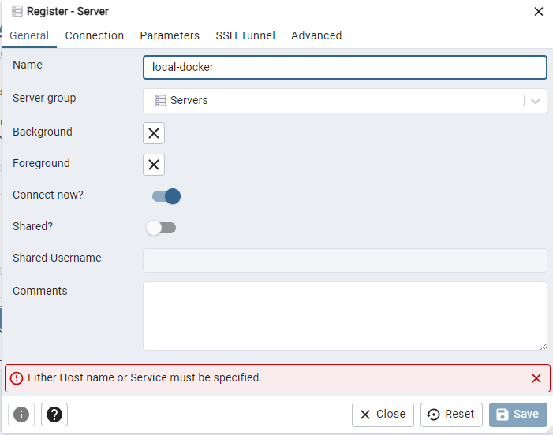

# TECH PENGUIN - KATALLER DOCKERS


## Practica 3 - PostgreSQL


El objetivo de la prácticaes arrancar un contenedor de BBDD PostgreSQL e inicializarlo y ver como conectarnos al mismo desde un contenedor PGAdmin para poder gestionarlo.

Para realizar una gestión mas sencilla del entorno se creara un fichero `docker-compose.yml` con el cual poder arrancar tanto la BBDD PostgreSQL como el PGAdmin para poder gestionarla.


> **NOTA:** se ha utilizado como referencia para la practica la guía [Load PostgreSQL Sample Database](https://www.postgresqltutorial.com/postgresql-getting-started/load-postgresql-sample-database/) 


### 01. Revisión del proyecto

La estructura del proyecto debe ser la siguiente

```
\TECH_PENGUIN\PRACTICAS\POSTGRESQL
\---backups
```


El contenido de las carpetas es el siguiente

- **backups**

  Backup de ejemplo.


### 02. Crear un docker-compose P

Se crea un docker-compose-yml para realizar una gestión mas sencilla del entorno y la BBDD postgres

docker-compose.yml

```
#################################################################################
#
# docker-compose para una gestión mas sencilla del entorno y la BBDD postgresql.
#
#
# v0.1
# Latest updated: 2024-04-12
#
#################################################################################

version: '3'

networks:
  tech-penguin-net:
    driver: bridge

services:  
  
##########
## BBDD ##
##########
  tech-penguin-postgres-pgadmin:
    image: dpage/pgadmin4
    container_name: tech-penguin-postgres-pgadmin-1
    environment:
      PGADMIN_DEFAULT_EMAIL: "tec@penguin.com"
      PGADMIN_DEFAULT_PASSWORD: "tec@penguin.com"
    networks:
      - tech-penguin-net
    ports:
      - 8080:80
```


[Ejemplos de salidas de comandos - Arranque PGAdmin](#arranque-pgadmin)


Se accede a la consola:

http://localhost:8080


Con las credenciales puestas en el docker-compose se puede acceder


### 03. Arrancar una BBDD Postgresql docker

Se arranca un contenedor postgresql. Para ello se modifica el `docker-compose.yml`

**docker-compose.yml**

```
#################################################################################
#
# docker-compose para una gestión mas sencilla del entorno y la BBDD postgresql.
#
#
# v0.1
# Latest updated: 2024-04-12
#
#################################################################################

version: '3'

networks:
  tech-penguin-net:
    driver: bridge

services:  
  
##########
## BBDD ##
##########
  tech-penguin-postgres-pgadmin:
    image: dpage/pgadmin4
    container_name: tech-penguin-postgres-pgadmin-1
    environment:
      PGADMIN_DEFAULT_EMAIL: "tec@penguin.com"
      PGADMIN_DEFAULT_PASSWORD: "tec@penguin.com"
    networks:
      - tech-penguin-net
    ports:
      - 8080:80
```


Se para la ejecución del docker-compose anterior, como no se ha dejado en segundo plano se debe hacer mediante un CTR-C.


Se arranca de nuevo el docker-compose modificado con la BBDD postgresql.

```
docker compose up
```


SE entra en PGadmin.

http://localhost:8080

Y configuramos la nueva BBDD





|                      |                       |      |
| -------------------- | --------------------- | ---- |
| **General**          |                       |      |
|                      | local-docker          |      |
| **Connection**       |                       |      |
| Host name/Address    | tech-penguin-postgres |      |
| port                 | 5432                  |      |
| Maintenance database | postgres              |      |
| Username             | tecpenguin            |      |
| Password             | tecpenguin.com        |      |


### **Incidencias Practica 3 - Postgresql**

**Sección con incidencias que nos podemos encontrar.**


### **Ejemplos de salidas de comandos**


#### **Arranque PGAdmin**

```
practicas\postgresql>docker compose up
[+] Running 1/1
 ✔ Container tech-penguin-postgres-pgadmin-1  Recreated                                                                                                                                                                                 0.1s
Attaching to tech-penguin-postgres-pgadmin-1
tech-penguin-postgres-pgadmin-1  | postfix/postlog: starting the Postfix mail system
tech-penguin-postgres-pgadmin-1  | [2024-04-12 10:42:28 +0000] [1] [INFO] Starting gunicorn 20.1.0
tech-penguin-postgres-pgadmin-1  | [2024-04-12 10:42:28 +0000] [1] [INFO] Listening at: http://[::]:80 (1)
tech-penguin-postgres-pgadmin-1  | [2024-04-12 10:42:28 +0000] [1] [INFO] Using worker: gthread
tech-penguin-postgres-pgadmin-1  | [2024-04-12 10:42:28 +0000] [87] [INFO] Booting worker with pid: 87
```


## **Referencias**


**Postgresql**

- **https://hub.docker.com/_/postgres**
- 
- **https://www.postgresqltutorial.com/postgresql-getting-started/load-postgresql-sample-database/**


**PGAdmin**

- **https://www.pgadmin.org/download/pgadmin-4-container/**
- **https://hub.docker.com/r/dpage/pgadmin4/**
- **https://www.pgadmin.org/docs/pgadmin4/latest/container_deployment.html**